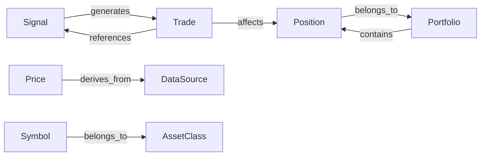

# Unified Domain Model Skill

## Purpose

Ensure consistency across all trading system components using Netflix's "Upper Metamodel" pattern.
Provides validation, relationship modeling, and multi-format schema generation.

## When to Use

- Creating new trades, signals, or positions
- Converting data between formats (Alpaca, yfinance, JSON)
- Validating domain objects before processing
- Understanding entity relationships
- Generating schemas for APIs, databases, or streaming

## Core Imports

```python
from src.core.unified_domain_model import (
    # Enums
    AssetClass, TradeAction, OrderStatus, SignalStrength, StrategyTier,
    # Domain Objects
    Symbol, Price, Signal, Trade, Position, Portfolio,
    # Validation
    DomainValidator, ValidationResult,
    # Relationships
    DomainGraph, RelationType,
    # Schema Generation
    SchemaGenerator,
    # Factory
    factory
)
```

## Quick Examples

### Create and Validate a Trade
```python
from src.core.unified_domain_model import factory, Trade, DomainValidator

btc = factory.create_crypto_symbol("BTCUSD")
trade = Trade(
    id="trade_001",
    symbol=btc,
    action=TradeAction.BUY,
    quantity=0.00011,
    price=Price(value=90125.56),
    notional=25.0,
    strategy=StrategyTier.TIER5_CRYPTO
)

# Validate before processing
if DomainValidator.is_valid(trade):
    execute_trade(trade)
else:
    result = DomainValidator.validate(trade)
    for error in result.errors:
        log_error(f"{error.field}: {error.message}")
```

### Query Entity Relationships
```python
from src.core.unified_domain_model import DomainGraph

# What does Trade relate to?
for rel in DomainGraph.get_relationships_for("Trade"):
    print(f"{rel.source_type} --{rel.relation.value}--> {rel.target_type}")

# Output:
# Signal --generates--> Trade
# Trade --references--> Signal
# Trade --affects--> Position

# Generate Mermaid diagram for documentation
print(DomainGraph.to_mermaid())
```

### Generate Schemas
```python
from src.core.unified_domain_model import SchemaGenerator, Trade

# Generate all formats at once
schemas = SchemaGenerator.generate_all(Trade)

# Individual generation
json_schema = SchemaGenerator.to_json_schema(Trade)   # API validation
avro_schema = SchemaGenerator.to_avro_schema(Trade)   # Kafka streaming
sql_ddl = SchemaGenerator.to_sql_ddl(Trade)           # PostgreSQL
graphql = SchemaGenerator.to_graphql_type(Trade)      # API layer
```

### Create Trading Signals
```python
signal = factory.create_signal(
    symbol=btc,
    action=TradeAction.BUY,
    confidence=0.85,
    source="text_analyzer"
)

if signal.is_actionable(min_confidence=0.6):
    execute_trade(signal)
```

### Symbol Format Conversion
```python
symbol = factory.create_crypto_symbol("BTCUSD")
print(symbol.to_alpaca())    # "BTCUSD"
print(symbol.to_yfinance())  # "BTC-USD"
```

## Available Enums

| Enum | Values |
|------|--------|
| `AssetClass` | equity, crypto, option, etf, bond |
| `TradeAction` | BUY, SELL, HOLD |
| `OrderStatus` | pending, submitted, filled, partial, cancelled, rejected |
| `SignalStrength` | strong_buy, buy, hold, sell, strong_sell |
| `StrategyTier` | tier1_safe, tier2_momentum, tier3_swing, tier4_options, tier5_crypto |
| `RelationType` | generates, affects, belongs_to, references, contains, derives_from |

## Validation Rules

| Entity | Field | Validators |
|--------|-------|------------|
| Symbol | ticker | NotEmpty, Pattern(A-Z0-9) |
| Price | value | Range(min=0) |
| Signal | confidence | Range(0.0-1.0) |
| Trade | id, quantity, notional | NotEmpty, Range(>=0) |
| Portfolio | equity, cash | Range(>=0) |

## Entity Relationships



## Integration Points

| Component | Usage |
|-----------|-------|
| `crypto_strategy.py` | Use `Trade`, `Signal`, validate before execution |
| `autonomous_trader.py` | Use `factory.create_trade_from_alpaca()` |
| `system_state.json` | Use `Portfolio.to_dict()` |
| `trades_*.json` | Use `Trade.to_dict()` |
| API endpoints | Use `SchemaGenerator.to_json_schema()` |
| PostgreSQL | Use `SchemaGenerator.to_sql_ddl()` |

## Source

Based on Netflix's Upper Metamodel: "Model Once, Represent Everywhere"
- [Netflix UDA](https://engineering.fyi/article/model-once-represent-everywhere)
- [W3C SHACL](https://www.w3.org/TR/shacl/) for validation patterns
