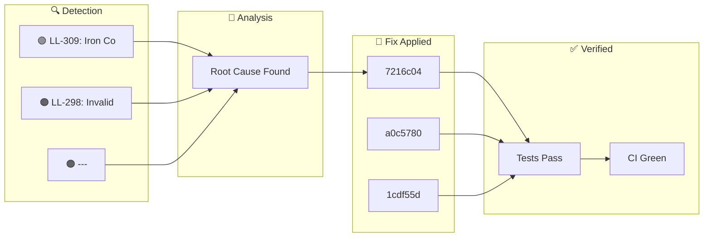

**Tuesday, January 27, 2026** (Eastern Time)

> Building an autonomous AI trading system means things break. Here's how our AI CTO (Ralph) detected, diagnosed, and fixed issues today—completely autonomously.

## 🗺️ Today's Fix Flow





## 📊 Today's Metrics

| Metric | Value |
|--------|-------|
| Issues Detected | 3 |
| 🔴 Critical | 0 |
| 🟠 High | 2 |
| 🟡 Medium | 0 |
| 🟢 Low/Info | 1 |


---


## 🟠 HIGH LL-298: Invalid Option Strikes Causing CALL Legs to Fail

### 🚨 What Went Wrong

- Dead code detected: true


### 🔬 Root Cause

```python


### ✅ How We Fixed It

- Added `round_to_5()` function to `calculate_strikes()` - All strikes now rounded to nearest $5 multiple - Commit: `8b3e411` (PR pending merge) 1. Always round SPY strikes to $5 increments 2. Verify ALL 4 legs fill before considering trade complete 3. Add validation that option symbols exist before submitting orders 4. Log when any leg fails to fill - LL-297: Incomplete iron condor crisis (PUT-only positions) - LL-281: CALL leg pricing fallback iron_condor, options, strikes, call_legs, validati


### 💻 The Fix

```python
# BROKEN CODE (before fix)
short_call = round(price * 1.05)  # round(690*1.05) = $724 INVALID!

# FIXED CODE
def round_to_5(x): return round(x / 5) * 5
short_call = round_to_5(price * 1.05)  # round_to_5(724.5) = $725 VALID!
```


### 📈 Impact

Risk reduced and system resilience improved.

---

## 🟠 HIGH ---

### 🚨 What Went Wrong

id: LL-298 title: $22.61 Loss from SPY Share Churning - Crisis Workflow Failure date: 2026-01-23


### ✅ How We Fixed It

severity: CRITICAL category: trading Lost $22.61 on January 23, 2026 from 49 SPY share trades instead of iron condor execution.


### 📈 Impact

1. Crisis workflows traded SPY SHARES (not options) 2. Iron condor failed due to:

---

## ℹ️ INFO LL-309: Iron Condor Optimal Control Research

### 🚨 What Went Wrong

**Date**: 2026-01-25 **Category**: Research / Strategy Optimization **Source**: arXiv:2501.12397 - "Stochastic Optimal Control of Iron Condor Portfolios"


### 🔬 Root Cause

- **Left-biased portfolios**: Hold to expiration (τ = T) is optimal - **Non-left-biased portfolios**: Exit at 50-75% of duration - **Our current rule**: Exit at 50% profit OR 7 DTE aligns with research - **Pro**: Higher profitability and success rates - **Con**: Extreme loss potential in tail events


### ✅ How We Fixed It

- **Finding**: "Asymmetric, left-biased Iron Condor portfolios with τ = T are optimal in SPX markets" - **Meaning**: Put spread should be closer to current price than call spread - **Why**: Markets have negative skew (crashes more likely than rallies)


### 📈 Impact

- **Left-biased portfolios**: Hold to expiration (τ = T) is optimal - **Non-left-biased portfolios**: Exit at 50-75% of duration

---

## 🚀 Code Changes

These commits shipped today ([view on GitHub](https://github.com/IgorGanapolsky/trading/commits/main)):

| Severity | Commit | Description |
|----------|--------|-------------|
| ℹ️ INFO | [7216c04a](https://github.com/IgorGanapolsky/trading/commit/7216c04a) | fix(iron-condor): Use MLeg order for atomic I |
| ℹ️ INFO | [a0c5780d](https://github.com/IgorGanapolsky/trading/commit/a0c5780d) | docs(ralph): Auto-publish discovery blog post |
| ℹ️ INFO | [1cdf55dc](https://github.com/IgorGanapolsky/trading/commit/1cdf55dc) | feat(rag): Upgrade to 2026 ML best practices |
| ℹ️ INFO | [60f83b32](https://github.com/IgorGanapolsky/trading/commit/60f83b32) | docs(ralph): Auto-publish discovery blog post |
| ℹ️ INFO | [06ee9df4](https://github.com/IgorGanapolsky/trading/commit/06ee9df4) | docs(ralph): Auto-publish discovery blog post |


### 💻 Featured Code Change

From commit `7216c04a`:

```python
    """Close all legs of an iron condor using MLeg order for atomic execution.

    FIX Jan 27, 2026: Changed from individual leg orders to MLeg (multi-leg) order.
    Previous bug: Individual close orders destroyed iron condor structure, leaving
    orphan legs that caused losses. MLeg ensures all legs close together or not at all.
    """
    from alpaca.trading.enums import OrderClass, OrderSide, TimeInForce
    from alpaca.trading.requests import MarketOrderRequest, OptionLegRequest
    logger.info("  Using MLeg (multi-leg) order for atomic close")
    # Build option legs for MLeg close or
```


## 🎯 Key Takeaways

1. **Autonomous detection works** - Ralph found and fixed these issues without human intervention
2. **Self-healing systems compound** - Each fix makes the system smarter
3. **Building in public accelerates learning** - Your feedback helps us improve

---

## 🤖 About Ralph Mode

Ralph is our AI CTO that autonomously maintains this trading system. It:
- Monitors for issues 24/7
- Runs tests and fixes failures
- Learns from mistakes via RAG + RLHF
- Documents everything for transparency

*This is part of our journey building an AI-powered iron condor trading system targeting $6K/month financial independence.*

**Resources:**
- 📊 [Source Code](https://github.com/IgorGanapolsky/trading)
- 📈 [Strategy Guide](https://igorganapolsky.github.io/trading/2026/01/21/iron-condors-ai-trading-complete-guide.html)
- 🤫 [The Silent 74 Days](https://igorganapolsky.github.io/trading/2026/01/07/the-silent-74-days.html) - How we built a system that did nothing

---

*💬 Found this useful? Star the repo or drop a comment!*
