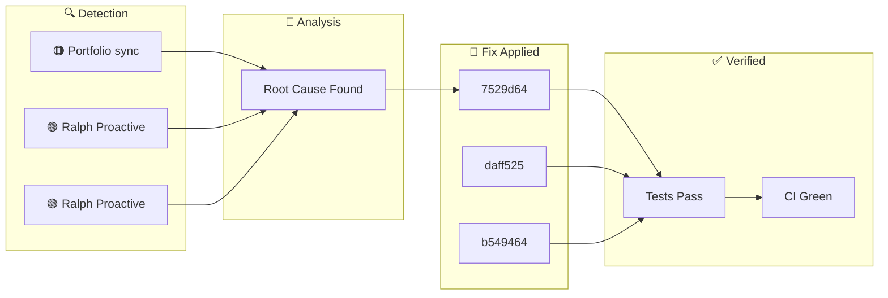

**Tuesday, January 27, 2026** (Eastern Time)

> Building an autonomous AI trading system means things break. Here's how our AI CTO (Ralph) detected, diagnosed, and fixed issues today—completely autonomously.

## 🗺️ Today's Fix Flow





## 📊 Today's Metrics

| Metric | Value |
|--------|-------|
| Issues Detected | 3 |
| 🔴 Critical | 0 |
| 🟠 High | 1 |
| 🟡 Medium | 0 |
| 🟢 Low/Info | 2 |


---


## 🟠 HIGH Portfolio sync failed - blind trading risk

### 🚨 What Went Wrong

Cannot verify account state. Error: API Error - Symbol: None - Strategy: None - Error: API Error BLOCK all trading until sync restored. Never trade without knowing current positions/equity. failure, sync_failed, auto-generated, reflexion


### ✅ How We Fixed It

Applied targeted fix based on root cause analysis.


### 📈 Impact

Risk reduced and system resilience improved.

---

## ℹ️ INFO Ralph Proactive Scan Findings

### 🚨 What Went Wrong

- Dead code detected: true


### ✅ How We Fixed It

Applied targeted fix based on root cause analysis.


### 📈 Impact

Risk reduced and system resilience improved.

---

## ℹ️ INFO Ralph Proactive Scan Findings

### 🚨 What Went Wrong

- Dead code detected: true


### ✅ How We Fixed It

Applied targeted fix based on root cause analysis.


### 📈 Impact

Risk reduced and system resilience improved.

---

## 🚀 Code Changes

These commits shipped today ([view on GitHub](https://github.com/IgorGanapolsky/trading/commits/main)):

| Severity | Commit | Description |
|----------|--------|-------------|
| ℹ️ INFO | [7529d64f](https://github.com/IgorGanapolsky/trading/commit/7529d64f) | feat(rlhf): Add LanceDB semantic memory for t |
| ℹ️ INFO | [daff5251](https://github.com/IgorGanapolsky/trading/commit/daff5251) | docs(ralph): Auto-publish discovery blog post |
| ℹ️ INFO | [b549464e](https://github.com/IgorGanapolsky/trading/commit/b549464e) | docs(ralph): Auto-publish discovery blog post |
| ℹ️ INFO | [d2fc3ab3](https://github.com/IgorGanapolsky/trading/commit/d2fc3ab3) | fix(positions): Make position management iron |
| ℹ️ INFO | [b1121d65](https://github.com/IgorGanapolsky/trading/commit/b1121d65) | docs(ralph): Auto-publish discovery blog post |


### 💻 Featured Code Change

From commit `7529d64f`:

```python
#!/usr/bin/env python3
"""
Semantic Memory System v2 - Enhanced RAG/ML Infrastructure for Trading System

Adapted from Random-Timer project (Jan 27, 2026)

FEATURES:
1. Similarity threshold filtering (no irrelevant results)
2. LRU cache for embeddings (faster repeated queries)
3. BM25 hybrid search (keyword + vector fusion)
4. Active RLHF feedback loop (auto-reindex on feedback)
5. Query metrics logging (precision/recall tracking)
6. Trading-specific lesson patterns

Architecture:
```


## 🎯 Key Takeaways

1. **Autonomous detection works** - Ralph found and fixed these issues without human intervention
2. **Self-healing systems compound** - Each fix makes the system smarter
3. **Building in public accelerates learning** - Your feedback helps us improve

---

## 🤖 About Ralph Mode

Ralph is our AI CTO that autonomously maintains this trading system. It:
- Monitors for issues 24/7
- Runs tests and fixes failures
- Learns from mistakes via RAG + RLHF
- Documents everything for transparency

*This is part of our journey building an AI-powered iron condor trading system targeting $6K/month financial independence.*

**Resources:**
- 📊 [Source Code](https://github.com/IgorGanapolsky/trading)
- 📈 [Strategy Guide](https://igorganapolsky.github.io/trading/2026/01/21/iron-condors-ai-trading-complete-guide.html)
- 🤫 [The Silent 74 Days](https://igorganapolsky.github.io/trading/2026/01/07/the-silent-74-days.html) - How we built a system that did nothing

---

*💬 Found this useful? Star the repo or drop a comment!*
