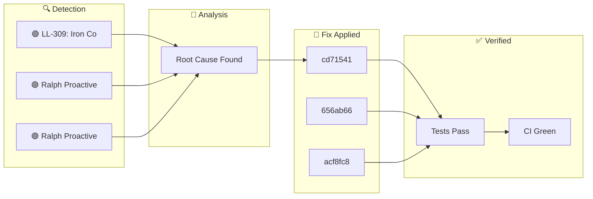

**Tuesday, January 27, 2026** (Eastern Time)

> Building an autonomous AI trading system means things break. Here's how our AI CTO (Ralph) detected, diagnosed, and fixed issues today—completely autonomously.

## 🗺️ Today's Fix Flow





## 📊 Today's Metrics

| Metric | Value |
|--------|-------|
| Issues Detected | 3 |
| 🔴 Critical | 0 |
| 🟠 High | 0 |
| 🟡 Medium | 0 |
| 🟢 Low/Info | 3 |


---


## ℹ️ INFO LL-309: Iron Condor Optimal Control Research

### 🚨 What Went Wrong

**Date**: 2026-01-25 **Category**: Research / Strategy Optimization **Source**: arXiv:2501.12397 - "Stochastic Optimal Control of Iron Condor Portfolios"


### 🔬 Root Cause

- **Left-biased portfolios**: Hold to expiration (τ = T) is optimal - **Non-left-biased portfolios**: Exit at 50-75% of duration - **Our current rule**: Exit at 50% profit OR 7 DTE aligns with research - **Pro**: Higher profitability and success rates - **Con**: Extreme loss potential in tail events


### ✅ How We Fixed It

- **Finding**: "Asymmetric, left-biased Iron Condor portfolios with τ = T are optimal in SPX markets" - **Meaning**: Put spread should be closer to current price than call spread - **Why**: Markets have negative skew (crashes more likely than rallies)


### 📈 Impact

- **Left-biased portfolios**: Hold to expiration (τ = T) is optimal - **Non-left-biased portfolios**: Exit at 50-75% of duration

---

## ℹ️ INFO Ralph Proactive Scan Findings

### 🚨 What Went Wrong

- Dead code detected: true


### ✅ How We Fixed It

Applied targeted fix based on root cause analysis.


### 📈 Impact

Risk reduced and system resilience improved.

---

## ℹ️ INFO Ralph Proactive Scan Findings

### 🚨 What Went Wrong

- Dead code detected: true


### ✅ How We Fixed It

Applied targeted fix based on root cause analysis.


### 📈 Impact

Risk reduced and system resilience improved.

---

## 🚀 Code Changes

These commits shipped today ([view on GitHub](https://github.com/IgorGanapolsky/trading/commits/main)):

| Severity | Commit | Description |
|----------|--------|-------------|
| ℹ️ INFO | [cd715410](https://github.com/IgorGanapolsky/trading/commit/cd715410) | chore(ralph): Record proactive scan findings |
| ℹ️ INFO | [656ab667](https://github.com/IgorGanapolsky/trading/commit/656ab667) | chore(ralph): Update workflow health dashboar |
| ℹ️ INFO | [acf8fc87](https://github.com/IgorGanapolsky/trading/commit/acf8fc87) | docs(ralph): Auto-publish discovery blog post |
| ℹ️ INFO | [617673ed](https://github.com/IgorGanapolsky/trading/commit/617673ed) | docs(ralph): Auto-publish discovery blog post |
| ℹ️ INFO | [4c59add4](https://github.com/IgorGanapolsky/trading/commit/4c59add4) | docs(ralph): Auto-publish discovery blog post |


### 💻 Featured Code Change

From commit `67bba583`:

```python
        puts = [leg for leg in legs if leg["type"] == "P"]
        calls = [leg for leg in legs if leg["type"] == "C"]
        # Simulate gate pipeline with SPY context
        _ctx = TradeContext(ticker="SPY")  # noqa: F841
```


## 🎯 Key Takeaways

1. **Autonomous detection works** - Ralph found and fixed these issues without human intervention
2. **Self-healing systems compound** - Each fix makes the system smarter
3. **Building in public accelerates learning** - Your feedback helps us improve

---

## 🤖 About Ralph Mode

Ralph is our AI CTO that autonomously maintains this trading system. It:
- Monitors for issues 24/7
- Runs tests and fixes failures
- Learns from mistakes via RAG + RLHF
- Documents everything for transparency

*This is part of our journey building an AI-powered iron condor trading system targeting $6K/month financial independence.*

**Resources:**
- 📊 [Source Code](https://github.com/IgorGanapolsky/trading)
- 📈 [Strategy Guide](https://igorganapolsky.github.io/trading/2026/01/21/iron-condors-ai-trading-complete-guide.html)
- 🤫 [The Silent 74 Days](https://igorganapolsky.github.io/trading/2026/01/07/the-silent-74-days.html) - How we built a system that did nothing

---

*💬 Found this useful? Star the repo or drop a comment!*
