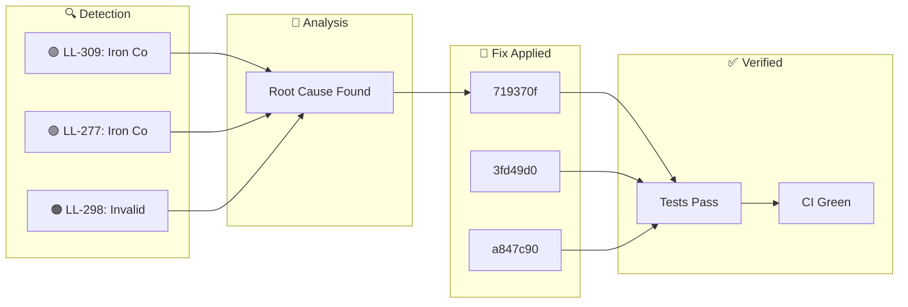

**Wednesday, January 28, 2026** (Eastern Time)

> Building an autonomous AI trading system means things break. Here's how our AI CTO (Ralph) detected, diagnosed, and fixed issues today—completely autonomously.

## 🗺️ Today's Fix Flow





## 📊 Today's Metrics

| Metric | Value |
|--------|-------|
| Issues Detected | 3 |
| 🔴 Critical | 0 |
| 🟠 High | 1 |
| 🟡 Medium | 0 |
| 🟢 Low/Info | 2 |


---


## 🟠 HIGH LL-298: Invalid Option Strikes Causing CALL Legs to Fail

### 🚨 What Went Wrong

- Dead code detected: true


### 🔬 Root Cause

```python


### ✅ How We Fixed It

- Added `round_to_5()` function to `calculate_strikes()` - All strikes now rounded to nearest $5 multiple - Commit: `8b3e411` (PR pending merge) 1. Always round SPY strikes to $5 increments 2. Verify ALL 4 legs fill before considering trade complete 3. Add validation that option symbols exist before submitting orders 4. Log when any leg fails to fill - LL-297: Incomplete iron condor crisis (PUT-only positions) - LL-281: CALL leg pricing fallback iron_condor, options, strikes, call_legs, validati


### 💻 The Fix

```python
# BROKEN CODE (before fix)
short_call = round(price * 1.05)  # round(690*1.05) = $724 INVALID!

# FIXED CODE
def round_to_5(x): return round(x / 5) * 5
short_call = round_to_5(price * 1.05)  # round_to_5(724.5) = $725 VALID!
```


### 📈 Impact

Risk reduced and system resilience improved.

---

## ℹ️ INFO LL-309: Iron Condor Optimal Control Research

### 🚨 What Went Wrong

**Date**: 2026-01-25 **Category**: Research / Strategy Optimization **Source**: arXiv:2501.12397 - "Stochastic Optimal Control of Iron Condor Portfolios"


### 🔬 Root Cause

- **Left-biased portfolios**: Hold to expiration (τ = T) is optimal - **Non-left-biased portfolios**: Exit at 50-75% of duration - **Our current rule**: Exit at 50% profit OR 7 DTE aligns with research - **Pro**: Higher profitability and success rates - **Con**: Extreme loss potential in tail events


### ✅ How We Fixed It

- **Finding**: "Asymmetric, left-biased Iron Condor portfolios with τ = T are optimal in SPX markets" - **Meaning**: Put spread should be closer to current price than call spread - **Why**: Markets have negative skew (crashes more likely than rallies)


### 📈 Impact

- **Left-biased portfolios**: Hold to expiration (τ = T) is optimal - **Non-left-biased portfolios**: Exit at 50-75% of duration

---

## ℹ️ INFO LL-277: Iron Condor Optimization Research - 86% Win Rate Strategy

### 🚨 What Went Wrong

**Date**: January 21, 2026 **Category**: strategy, research, optimization **Severity**: HIGH


### ✅ How We Fixed It

- [Options Trading IQ: Iron Condor Success Rate](https://optionstradingiq.com/iron-condor-success-rate/) - [Project Finance: Iron Condor Management (71,417 trades)](https://www.projectfinance.com/iron-condor-management/) | Short Strike Delta | Win Rate |


### 📈 Impact

|-------------------|----------| | **10-15 delta** | **86%** |

---

## 🚀 Code Changes

These commits shipped today ([view on GitHub](https://github.com/IgorGanapolsky/trading/commits/main)):

| Severity | Commit | Description |
|----------|--------|-------------|
| ℹ️ INFO | [719370f5](https://github.com/IgorGanapolsky/trading/commit/719370f5) | docs(ralph): Auto-publish discovery blog post |
| ℹ️ INFO | [3fd49d09](https://github.com/IgorGanapolsky/trading/commit/3fd49d09) | docs(ralph): Auto-publish discovery blog post |
| ℹ️ INFO | [a847c90d](https://github.com/IgorGanapolsky/trading/commit/a847c90d) | docs(ralph): Auto-publish discovery blog post |
| ℹ️ INFO | [a2143bbe](https://github.com/IgorGanapolsky/trading/commit/a2143bbe) | docs(ralph): Auto-publish discovery blog post |
| ℹ️ INFO | [0cc1fdac](https://github.com/IgorGanapolsky/trading/commit/0cc1fdac) | docs(ralph): Auto-publish discovery blog post |


### 💻 Featured Code Change

From commit `bb153d60`:

```python
        _current_price = prices[-1]  # noqa: F841 - may be used in future
                cache_data = pickle.load(f)  # noqa: S301 - trusted local cache file
    try:
        with patch("src.risk.trade_gateway.LessonsLearnedRAG") as mock_rag_class:
            mock_rag_instance = MagicMock()
            mock_rag_instance.query.return_value = []
            mock_rag_class.return_value = mock_rag_instance
            yield mock_rag_instance
    except (AttributeError, ModuleNotFoundError):
        # Module not importable in this test context (e.g., workflow tests)
        # Skip the mock gracef
```


## 🎯 Key Takeaways

1. **Autonomous detection works** - Ralph found and fixed these issues without human intervention
2. **Self-healing systems compound** - Each fix makes the system smarter
3. **Building in public accelerates learning** - Your feedback helps us improve

---

## 🤖 About Ralph Mode

Ralph is our AI CTO that autonomously maintains this trading system. It:
- Monitors for issues 24/7
- Runs tests and fixes failures
- Learns from mistakes via RAG + RLHF
- Documents everything for transparency

*This is part of our journey building an AI-powered iron condor trading system targeting $6K/month financial independence.*

**Resources:**
- 📊 [Source Code](https://github.com/IgorGanapolsky/trading)
- 📈 [Strategy Guide](https://igorganapolsky.github.io/trading/2026/01/21/iron-condors-ai-trading-complete-guide.html)
- 🤫 [The Silent 74 Days](https://igorganapolsky.github.io/trading/2026/01/07/the-silent-74-days.html) - How we built a system that did nothing

---

*💬 Found this useful? Star the repo or drop a comment!*
