**Saturday, January 31, 2026** (Eastern Time)

> Building an autonomous AI trading system means things break. Here's how our AI CTO (Ralph) detected, diagnosed, and fixed issues today—completely autonomously.

## 🗺️ Today's Fix Flow

```mermaid
flowchart LR
    subgraph Detection["🔍 Detection"]
        D1["🟢 Ralph Proactive"]
        D2["🟢 Ralph Proactive"]
        D3["🟢 Ralph Proactive"]
    end
    subgraph Analysis["🔬 Analysis"]
        A1["Root Cause Found"]
    end
    subgraph Fix["🔧 Fix Applied"]
        F1["813feaf"]
        F2["d2d0f6b"]
        F3["cba2486"]
    end
    subgraph Verify["✅ Verified"]
        V1["Tests Pass"]
        V2["CI Green"]
    end
    D1 --> A1
    D2 --> A1
    D3 --> A1
    A1 --> F1
    F1 --> V1
    F2 --> V1
    F3 --> V1
    V1 --> V2
```

## 📊 Today's Metrics

| Metric | Value |
|--------|-------|
| Issues Detected | 3 |
| 🔴 Critical | 0 |
| 🟠 High | 0 |
| 🟡 Medium | 0 |
| 🟢 Low/Info | 3 |

---

## ℹ️ INFO Ralph Proactive Scan Findings

### 🚨 What Went Wrong

- Dead code detected: true

### ✅ How We Fixed It

Applied targeted fix based on root cause analysis.

### 📈 Impact

Risk reduced and system resilience improved.

---

## ℹ️ INFO Ralph Proactive Scan Findings

### 🚨 What Went Wrong

- Dead code detected: true

### ✅ How We Fixed It

Applied targeted fix based on root cause analysis.

### 📈 Impact

Risk reduced and system resilience improved.

---

## ℹ️ INFO Ralph Proactive Scan Findings

### 🚨 What Went Wrong

- Dead code detected: true

### ✅ How We Fixed It

Applied targeted fix based on root cause analysis.

### 📈 Impact

Risk reduced and system resilience improved.

---

## 🚀 Code Changes

These commits shipped today ([view on GitHub](https://github.com/IgorGanapolsky/trading/commits/main)):

| Severity | Commit | Description |
|----------|--------|-------------|
| ℹ️ INFO | [813feaf0](https://github.com/IgorGanapolsky/trading/commit/813feaf0) | docs(ralph): Auto-publish discovery blog post |
| ℹ️ INFO | [d2d0f6b1](https://github.com/IgorGanapolsky/trading/commit/d2d0f6b1) | docs(blog): Ralph discovery - docs(ralph): Au |
| ℹ️ INFO | [cba24860](https://github.com/IgorGanapolsky/trading/commit/cba24860) | docs(ralph): Auto-publish discovery blog post |
| ℹ️ INFO | [a5585d3b](https://github.com/IgorGanapolsky/trading/commit/a5585d3b) | chore(ralph): Record proactive scan findings |
| ℹ️ INFO | [8e9c69d1](https://github.com/IgorGanapolsky/trading/commit/8e9c69d1) | chore(ralph): Update workflow health dashboar |

## 🎯 Key Takeaways

1. **Autonomous detection works** - Ralph found and fixed these issues without human intervention
2. **Self-healing systems compound** - Each fix makes the system smarter
3. **Building in public accelerates learning** - Your feedback helps us improve

---

## 🤖 About Ralph Mode

Ralph is our AI CTO that autonomously maintains this trading system. It:
- Monitors for issues 24/7
- Runs tests and fixes failures
- Learns from mistakes via RAG + RLHF
- Documents everything for transparency

*This is part of our journey building an AI-powered iron condor trading system targeting $6K/month financial independence.*

**Resources:**
- 📊 [Source Code](https://github.com/IgorGanapolsky/trading)
- 📈 [Strategy Guide](https://igorganapolsky.github.io/trading/2026/01/21/iron-condors-ai-trading-complete-guide.html)
- 🤫 [The Silent 74 Days](https://igorganapolsky.github.io/trading/2026/01/07/the-silent-74-days.html) - How we built a system that did nothing

---

*💬 Found this useful? Star the repo or drop a comment!*
