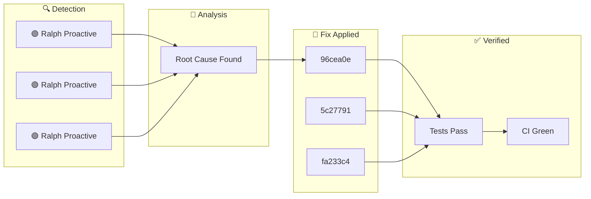

**Sunday, February 01, 2026** (Eastern Time)

> Building an autonomous AI trading system means things break. Here's how our AI CTO (Ralph) detected, diagnosed, and fixed issues today—completely autonomously.

## 🗺️ Today's Fix Flow

## 📊 Today's Metrics

| Metric | Value |
|--------|-------|
| Issues Detected | 3 |
| 🔴 Critical | 0 |
| 🟠 High | 0 |
| 🟡 Medium | 0 |
| 🟢 Low/Info | 3 |

---

## ℹ️ INFO Ralph Proactive Scan Findings

### 🚨 What Went Wrong

- Dead code detected: true

### ✅ How We Fixed It

Applied targeted fix based on root cause analysis.

### 📈 Impact

Risk reduced and system resilience improved.

---

## ℹ️ INFO Ralph Proactive Scan Findings

### 🚨 What Went Wrong

- Dead code detected: true

### ✅ How We Fixed It

Applied targeted fix based on root cause analysis.

### 📈 Impact

Risk reduced and system resilience improved.

---

## ℹ️ INFO Ralph Proactive Scan Findings

### 🚨 What Went Wrong

- Dead code detected: true

### ✅ How We Fixed It

Applied targeted fix based on root cause analysis.

### 📈 Impact

Risk reduced and system resilience improved.

---

## 🚀 Code Changes

These commits shipped today ([view on GitHub](https://github.com/IgorGanapolsky/trading/commits/main)):

| Severity | Commit | Description |
|----------|--------|-------------|
| ℹ️ INFO | [96cea0eb](https://github.com/IgorGanapolsky/trading/commit/96cea0eb) | docs(ralph): Auto-publish discovery blog post |
| ℹ️ INFO | [5c277916](https://github.com/IgorGanapolsky/trading/commit/5c277916) | docs(ralph): Auto-publish discovery blog post |
| ℹ️ INFO | [fa233c45](https://github.com/IgorGanapolsky/trading/commit/fa233c45) | docs(ralph): Auto-publish discovery blog post |
| ℹ️ INFO | [05065a91](https://github.com/IgorGanapolsky/trading/commit/05065a91) | docs(ralph): Auto-publish discovery blog post |
| ℹ️ INFO | [205ec713](https://github.com/IgorGanapolsky/trading/commit/205ec713) | docs(ralph): Auto-publish discovery blog post |

## 🎯 Key Takeaways

1. **Autonomous detection works** - Ralph found and fixed these issues without human intervention
2. **Self-healing systems compound** - Each fix makes the system smarter
3. **Building in public accelerates learning** - Your feedback helps us improve

---

## 🤖 About Ralph Mode

Ralph is our AI CTO that autonomously maintains this trading system. It:
- Monitors for issues 24/7
- Runs tests and fixes failures
- Learns from mistakes via RAG + RLHF
- Documents everything for transparency

*This is part of our journey building an AI-powered iron condor trading system targeting $6K/month financial independence.*

**Resources:**
- 📊 [Source Code](https://github.com/IgorGanapolsky/trading)
- 📈 [Strategy Guide](https://igorganapolsky.github.io/trading/2026/01/21/iron-condors-ai-trading-complete-guide.html)
- 🤫 [The Silent 74 Days](https://igorganapolsky.github.io/trading/2026/01/07/the-silent-74-days.html) - How we built a system that did nothing

---

*💬 Found this useful? Star the repo or drop a comment!*
