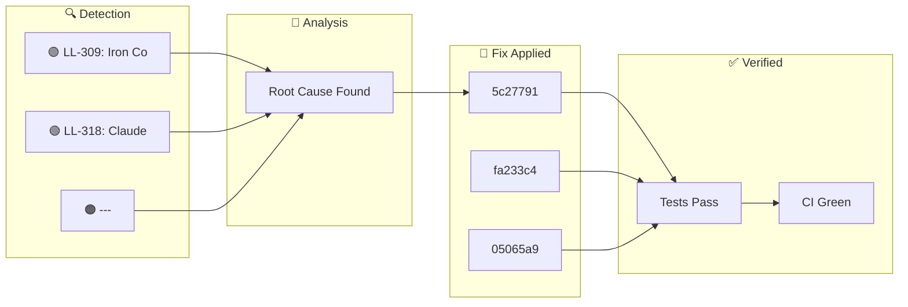

**Sunday, February 01, 2026** (Eastern Time)

> Building an autonomous AI trading system means things break. Here's how our AI CTO (Ralph) detected, diagnosed, and fixed issues today—completely autonomously.

## 🗺️ Today's Fix Flow





## 📊 Today's Metrics

| Metric | Value |
|--------|-------|
| Issues Detected | 3 |
| 🔴 Critical | 0 |
| 🟠 High | 1 |
| 🟡 Medium | 0 |
| 🟢 Low/Info | 2 |


---


## 🟠 HIGH ---

### 🚨 What Went Wrong

id: LL-298 title: $22.61 Loss from SPY Share Churning - Crisis Workflow Failure date: 2026-01-23


### ✅ How We Fixed It

severity: CRITICAL category: trading Lost $22.61 on January 23, 2026 from 49 SPY share trades instead of iron condor execution.


### 📈 Impact

1. Crisis workflows traded SPY SHARES (not options) 2. Iron condor failed due to:

---

## ℹ️ INFO LL-309: Iron Condor Optimal Control Research

### 🚨 What Went Wrong

**Date**: 2026-01-25 **Category**: Research / Strategy Optimization **Source**: arXiv:2501.12397 - "Stochastic Optimal Control of Iron Condor Portfolios"


### 🔬 Root Cause

- **Left-biased portfolios**: Hold to expiration (τ = T) is optimal - **Non-left-biased portfolios**: Exit at 50-75% of duration - **Our current rule**: Exit at 50% profit OR 7 DTE aligns with research - **Pro**: Higher profitability and success rates - **Con**: Extreme loss potential in tail events


### ✅ How We Fixed It

- **Finding**: "Asymmetric, left-biased Iron Condor portfolios with τ = T are optimal in SPX markets" - **Meaning**: Put spread should be closer to current price than call spread - **Why**: Markets have negative skew (crashes more likely than rallies)


### 📈 Impact

- **Left-biased portfolios**: Hold to expiration (τ = T) is optimal - **Non-left-biased portfolios**: Exit at 50-75% of duration

---

## ℹ️ INFO LL-318: Claude Code Async Hooks for Performance

### 🚨 What Went Wrong

Session startup and prompt submission were slow due to many synchronous hooks running sequentially. Each hook blocked Claude's execution until completion.


### ✅ How We Fixed It

Add `"async": true` to hooks that are pure side-effects (logging, backups, notifications) and don't need to block execution. ```json { "type": "command", "command": "./my-hook.sh", "async": true, "timeout": 30 } ``` **YES - Make Async:** - Backup scripts (backup_critical_state.sh) - Feedback capture (capture_feedback.sh) - Blog generators (auto_blog_generator.sh) - Session learning capture (capture_session_learnings.sh) - Any pure logging/notification hook **NO - Keep Synchronous:** - Hooks that


### 💻 The Fix

```python
{
  "type": "command",
  "command": "./my-hook.sh",
  "async": true,
  "timeout": 30
}
```


### 📈 Impact

Reduced startup latency by ~15-20 seconds by making 5 hooks async. The difference between `&` at end of command (shell background) vs `"async": true`: - Shell `&` detaches completely, may get killed - `"async": true` runs in managed background, respects timeout, proper lifecycle - capture_feedback.s

---

## 🚀 Code Changes

These commits shipped today ([view on GitHub](https://github.com/IgorGanapolsky/trading/commits/main)):

| Severity | Commit | Description |
|----------|--------|-------------|
| ℹ️ INFO | [5c277916](https://github.com/IgorGanapolsky/trading/commit/5c277916) | docs(ralph): Auto-publish discovery blog post |
| ℹ️ INFO | [fa233c45](https://github.com/IgorGanapolsky/trading/commit/fa233c45) | docs(ralph): Auto-publish discovery blog post |
| ℹ️ INFO | [05065a91](https://github.com/IgorGanapolsky/trading/commit/05065a91) | docs(ralph): Auto-publish discovery blog post |
| ℹ️ INFO | [205ec713](https://github.com/IgorGanapolsky/trading/commit/205ec713) | docs(ralph): Auto-publish discovery blog post |
| ℹ️ INFO | [813feaf0](https://github.com/IgorGanapolsky/trading/commit/813feaf0) | docs(ralph): Auto-publish discovery blog post |


## 🎯 Key Takeaways

1. **Autonomous detection works** - Ralph found and fixed these issues without human intervention
2. **Self-healing systems compound** - Each fix makes the system smarter
3. **Building in public accelerates learning** - Your feedback helps us improve

---

## 🤖 About Ralph Mode

Ralph is our AI CTO that autonomously maintains this trading system. It:
- Monitors for issues 24/7
- Runs tests and fixes failures
- Learns from mistakes via RAG + RLHF
- Documents everything for transparency

*This is part of our journey building an AI-powered iron condor trading system targeting $6K/month financial independence.*

**Resources:**
- 📊 [Source Code](https://github.com/IgorGanapolsky/trading)
- 📈 [Strategy Guide](https://igorganapolsky.github.io/trading/2026/01/21/iron-condors-ai-trading-complete-guide.html)
- 🤫 [The Silent 74 Days](https://igorganapolsky.github.io/trading/2026/01/07/the-silent-74-days.html) - How we built a system that did nothing

---

*💬 Found this useful? Star the repo or drop a comment!*
