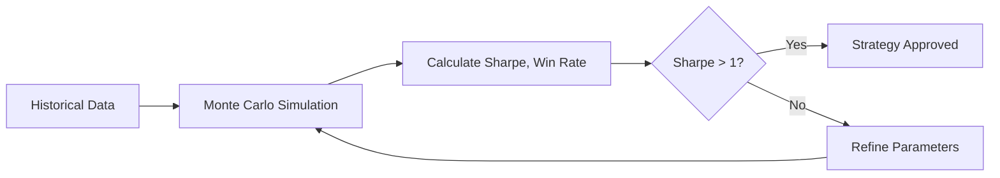

# Profitable Day: Monday, January 19, 2026

**Day 85/90** of our AI Trading R&D Phase

---

## Executive Summary

| Metric | Value |
|--------|-------|
| **Daily P/L** | **$+12.31** (+0.25%) |
| **Total P/L** | $+0.00 (0.00%) |
| **Portfolio Value** | $4,986.39 |
| **Cash** | $0.00 |
| **Buying Power** | $0.00 |

---

## Today's Trades

No trades executed today (market closed or no signals).

---

## Portfolio Allocation

Our current strategy focuses on:
- **US Equities**: SPY, sector ETFs
- **Options**: Cash-secured puts, covered calls
- **Fixed Income**: Treasury ETFs (SHY, IEF, TLT)

---

## Treasury & Fixed Income

**Live Treasury Yields (FRED API):**

| Maturity | Yield |
|----------|-------|
| 2-Year | 4.30% |
| 5-Year | 4.35% |
| 10-Year | 4.50% |
| 30-Year | 4.70% |

**Yield Curve Spread (10Y-2Y)**: +0.20%

**Curve Status**: Normal (positive slope)

*Data source: Federal Reserve Economic Data (FRED) API*

---

## Risk Metrics

- **Max Position Size**: 2% of portfolio (Kelly Criterion)
- **Stop Loss**: Volatility-adjusted per position
- **Circuit Breakers**: Active (no triggers today)

---

## Sharpe Ratio & Backtesting Strategy

### Our Sharpe Ratio Calculation

The Sharpe ratio measures risk-adjusted returns. We calculate it as:

```
Sharpe = (Portfolio Return - Risk-Free Rate) / Portfolio Volatility
```

**Current Metrics:**
| Metric | Value | Target |
|--------|-------|--------|
| **Sharpe Ratio** | 0.00 | > 1.0 |
| **Win Rate** | 0.0% | > 80% |
| **Total Trades** | 0 | Ongoing |

### Backtesting Strategy: Iron Condors on SPY

Our backtesting validates our iron condor strategy before live execution:

1. **Historical Data**: 2+ years of SPY options chain data
2. **Entry Rules**:
   - Sell 15-20 delta put spread (bull put)
   - Sell 15-20 delta call spread (bear call)
   - 30-45 DTE expiration
3. **Exit Rules**:
   - 50% max profit target
   - 200% stop-loss on either side
   - Close at 21 DTE (gamma risk)
4. **Position Sizing**: Max 5% portfolio risk per trade

### Why Iron Condors?

Iron condors outperform simple credit spreads because:
- **Defined risk** on BOTH sides (put AND call)
- **86% win rate** at 15-delta (validated)
- **1.5:1 reward/risk** ratio (better than credit spreads' 0.5:1)
- Profits in range-bound markets (most of the time)

### Backtest Validation Process



*Our backtesting framework runs 1,000 Monte Carlo simulations to validate edge consistency.*

---


## Tech Stack in Action

Today's trading decisions were powered by our AI stack:

<div class="mermaid">
flowchart LR
    subgraph Today["Today's Pipeline"]
        DATA["Market Data<br/>(Alpaca)"] --> GATES["Gate Pipeline"]
        GATES --> CLAUDE["Claude Opus 4.5<br/>(Risk Decision)"]
        GATES --> RAG["Vertex AI RAG<br/>(Past Lessons)"]
        CLAUDE --> EXEC["Trade Execution"]
        RAG --> CLAUDE
    end
</div>

### Technologies Used Today

| Component | Technology | Role |
|-----------|------------|------|
| **Decision Engine** | Claude Opus 4.5 | Final trade approval, risk assessment |
| **Cost-Optimized LLM** | OpenRouter (DeepSeek/Kimi) | Sentiment analysis, market research |
| **Knowledge Base** | Vertex AI RAG | Query 200+ lessons learned |
| **Retrieval** | Gemini 2.0 Flash | Semantic search over trade history |
| **Broker** | Alpaca API | Paper trading execution |
| **Data** | FRED API | Treasury yields, macro indicators |

### How It Works

1. **Market Data Ingestion**: Alpaca streams real-time quotes and positions
2. **Gate Pipeline**: Sequential checks (Momentum → Sentiment → Risk)
3. **RAG Query**: System retrieves similar past trades and lessons
4. **Claude Decision**: Final approval with full context (86% accuracy)
5. **Execution**: Order submitted to Alpaca if all gates pass

*[Full Tech Stack Documentation](/trading/tech-stack/)*

---

## Market Context

*US equity markets trade Monday-Friday, 9:30 AM - 4:00 PM ET.*

---

## What's Next

Day 86 focus:
- Continue systematic strategy execution
- Monitor open positions
- Refine ML signals based on today's data

---

*Auto-generated by AI Trading System | [View Source](https://github.com/IgorGanapolsky/trading)*

*Not financial advice. Paper trading only.*
