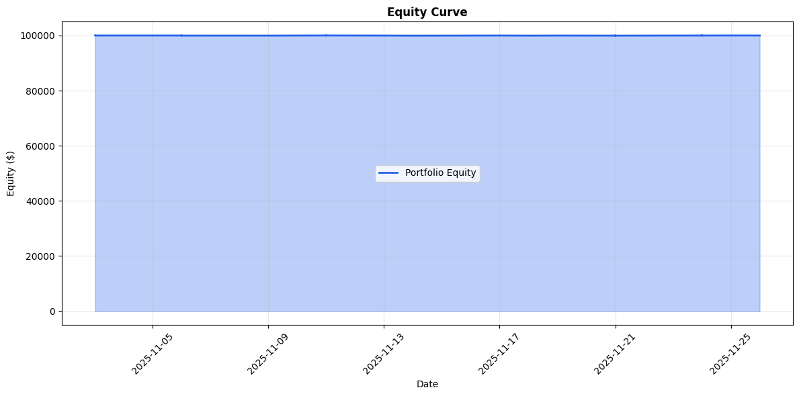
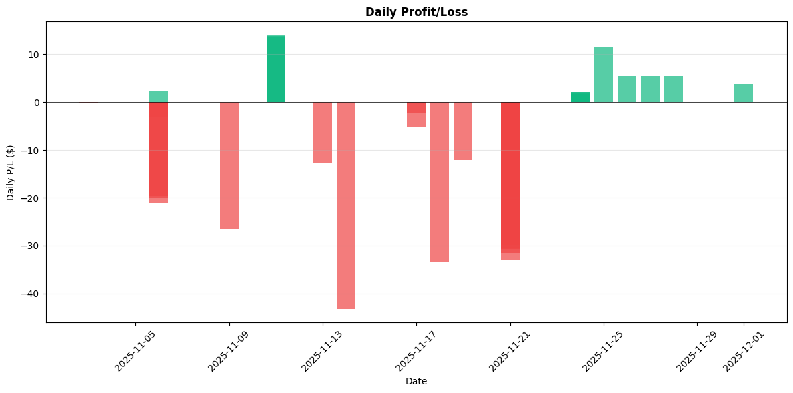
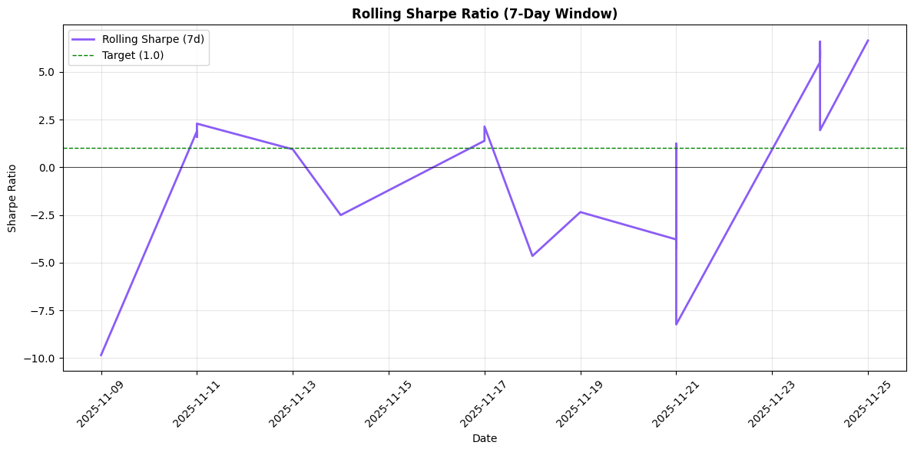
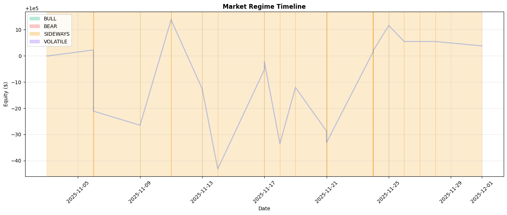

# 📊 Progress Dashboard

**Last Updated**: 2025-12-01 08:07 AM ET
**Auto-Updated**: Daily via GitHub Actions

---

## 📅 Today's Performance

**Date**: 2025-12-01 (Monday)

| Metric | Value |
|--------|-------|
| **Equity** | $100,005.48 |
| **P/L** | $+0.00 (+0.00%) |
| **Trades Today** | 0 |
| **Status** | ⏸️ No activity yet |

---

## 🎯 North Star Goal

**Target**: **$100+/day profit**

| Metric | Current | Target | Progress |
|--------|---------|--------|----------|
| **Average Daily Profit** | $0.15/day | $100.00/day | 0.15% |
| **Total P/L** | $+5.48 (+0.01%) | TBD | ✅ |
| **Win Rate** | 0.0% | >55% | ⚠️ |

**Progress Bar**: `█░░░░░░░░░░░░░░░░░░░` (0.15%)

**Assessment**: ⚠️ **R&D PHASE** - Learning, not earning yet

---

## 🌐 External Dashboards & Monitoring

### LangSmith Observability
- **[LangSmith Dashboard](https://smith.langchain.com)** - Main dashboard
- **[Trading RL Training Project](https://smith.langchain.com/o/bb00a62e-c62a-4c42-9031-43e1f74bb5b3/projects/p/04fa554e-f155-4039-bb7f-e866f082103b)** - RL training runs and traces
  *Project ID: `04fa554e-f155-4039-bb7f-e866f082103b`*
  *Note: Project may display as "default" in LangSmith UI - this is the correct project*
- **[All Projects](https://smith.langchain.com/o/default/projects)** - View all LangSmith projects

### Vertex AI Cloud RL
- **[Vertex AI Console](https://console.cloud.google.com/vertex-ai?project=email-outreach-ai-460404)** - Main Vertex AI dashboard
- **[Training Jobs](https://console.cloud.google.com/vertex-ai/training/custom-jobs?project=email-outreach-ai-460404)** - View RL training jobs
- **[Models](https://console.cloud.google.com/vertex-ai/models?project=email-outreach-ai-460404)** - Trained models
- **[Experiments](https://console.cloud.google.com/vertex-ai/experiments?project=email-outreach-ai-460404)** - Training experiments

**Project**: `email-outreach-ai-460404` | **Location**: `us-central1`

---

## 📈 90-Day R&D Challenge Progress

**Current**: Day 9 of 90 (10.0% complete)
**Phase**: Production Scaling - Month 2 (Days 31-60)
**Days Remaining**: 81

**Progress Bar**: `██░░░░░░░░░░░░░░░░░░` (10.0%)

### Challenge Goals (Month 1 - Days 1-30)

- [x] System reliability 99%+ ✅
- [ ] Win rate >55% (0.0%)
- [ ] 30 days of clean data (9/30 days)
- [ ] Sharpe ratio >1.0 (-16.60)
- [ ] Strategy validated via backtesting

### R&D Metrics Summary

| Metric | Value |
|--------|-------|
| **Days Completed** | 9 |
| **Trades Collected** | 7 |
| **Current Sharpe (R&D)** | -16.60 |
| **Max Drawdown (R&D)** | 0.06% |

---

## 💰 Financial Performance

### Account Summary

| Metric | Overall | Today |
|--------|---------|-------|
| **Equity** | $100,005.50 | $100,005.48 |
| **P/L** | $+5.50 (+0.01%) | $+0.00 (+0.00%) |
| **Starting Balance** | $100,000.00 | - |
| **Average Daily Profit** | $+0.15 | - |
| **Peak Equity** | $100,013.98 | - |

### Trading Performance

| Metric | Value |
|--------|-------|
| **Total Trades** | 7 |
| **Winning Trades** | 0 |
| **Losing Trades** | 0 |
| **Win Rate** | 0.0% |
| **Trades Today** | 0 |

---

## 🛡️ Risk & Performance Depth

### Risk Metrics

| Metric | Value | Target |
|--------|-------|--------|
| **Max Drawdown** | 0.06% | <10% |
| **Current Drawdown** | 0.01% | <5% |
| **Sharpe Ratio** | -16.60 | >1.0 |
| **Sortino Ratio** | -23.17 | >1.5 |
| **Volatility (Annualized)** | 0.24% | <20% |
| **Worst Daily Loss** | -0.03% | >-5% |
| **VaR (95th percentile)** | -0.03% | >-3% |

### Risk-Adjusted Performance

| Metric | Value |
|--------|-------|
| **Profit Factor** | 0.00 |
| **Expectancy per Trade** | $0.00 |
| **Expectancy per R** | 0.00 |
| **Win/Loss Ratio** | 0.00 |
| **Avg Win/Loss Ratio (R-multiple)** | 0.00 |
| **Average Win** | $0.00 |
| **Average Loss** | $0.00 |
| **Largest Win** | $0.00 |
| **Largest Loss** | $0.00 |

---

## 📊 Strategy & Model Diagnostics

### Per-Strategy Performance

*Performance attribution analysis requires at least 10 trades (currently have 7).*

| *No strategy data available* | - | - | - | - | - |

---

## 💼 Position & Exposure

### Exposure Snapshot

| Ticker | Position $ | % of Equity | Sector | Strategy |
|--------|-------------|-------------|--------|----------|
| *No open positions* | - | - | - | - |

### Exposure Summary

| Metric | Value |
|--------|-------|
| **Largest Position** | 0.00% of equity |
| **Total Exposure** | $0.00 |

### Asset Class Breakdown

| Asset Class | Exposure | % of Equity | % of Portfolio |
|-------------|----------|-------------|----------------|
| **Crypto** | $0.00 | 0.00% | 0.00% |
| **Equities** | $0.00 | 0.00% | 0.00% |
| **Bonds** | $0.00 | 0.00% | 0.00% |

### Investment by Asset Class (Total Invested)

| Asset Class | Total Invested | Trades Executed |
|-------------|----------------|-----------------|
| **Equities** | $1,621.93 | 7 |
| **Bonds** | $0.00 | 0 |
| **Crypto** | $0.00 | 0 |

---

## 🚨 Risk Guardrails & Safety

### Live Risk Status

| Guardrail | Current | Limit | Status |
|-----------|---------|-------|--------|
| **Daily Loss Used** | $0.00 (0.0%) | $2,000.11 | ✅ |
| **Max Position Size** | 0.00% | 10.0% | ✅ |
| **Consecutive Losses** | 0 | 5 | ✅ |

---

## 📊 Market Regime & Benchmarking

### Market Regime Detection

| Metric | Value |
|--------|-------|
| **Current Regime** | SIDEWAYS |
| **Confidence** | 0.3 |
| **Trend Strength** | 0.00 |
| **Volatility Regime** | LOW |
| **Avg Daily Return** | +0.00% |
| **Volatility** | 0.01% |

### Benchmark Comparison (vs S&P 500)

| Metric | Portfolio | Benchmark | Difference |
|--------|-----------|-----------|------------|
| **Total Return** | +0.01% | +0.00% | +0.00% |
| **Alpha** | +0.00% | - | ⚠️ Underperforming |
| **Beta** | 0.00 | 1.0 | Lower Risk |
| **Data Status** | ⚠️ Limited | - | - |

---

## 🤖 System Status & Automation

### Automation Health

| Component | Status |
|-----------|--------|
| **GitHub Actions** | {automation_emoji} {basic_metrics['automation_status']} |
| **Uptime** | 100.0% |
| **Reliability Streak** | 1 executions |
| **Last Execution** | 2025-11-11T21:11:00 |
| **Days Since Execution** | 19 days |
| **Total Executions** | 1 |
| **Failures** | 0 |
| **Health Checks** | ✅ Integrated |
| **Order Validation** | ✅ Active |

### TURBO MODE Status

| System | Status |
|--------|--------|
| **Go ADK Orchestrator** | ✅ Enabled |
| **Langchain Agents** | ✅ Enabled |
| **Python Strategies** | ✅ Active (Fallback) |
| **Sentiment RAG** | ✅ Active |

---

## 📈 Time-Series & Equity Curve

### Visual Charts

### Daily Profit Trend

**Last 10 Days**:

| Date | Equity | P/L | P/L % |
|------|--------|-----|-------|
| 2025-11-24 | $100,001.69 | $+1.69 | +0.17% |
| 2025-11-24 | $100,001.69 | $+1.69 | +0.17% |
| 2025-11-24 | $100,001.43 | $+1.43 | +0.14% |
| 2025-11-24 | $100,002.08 | $+2.08 | +0.21% |
| 2025-11-24 | $100,002.19 | $+2.19 | +0.22% |
| 2025-11-24 | $100,001.96 | $+1.96 | +0.20% |
| 2025-11-25 | $100,011.62 | $+11.62 | +1.16% |
| 2025-11-26 | $100,005.48 | $+5.48 | +0.55% |
| 2025-11-27 | $100,005.48 | $+5.48 | +0.55% |
| 2025-11-28 | $100,005.48 | $+5.48 | +0.55% |

### Equity Curve Summary

| Metric | Value |
|--------|-------|
| **Trading Days Tracked** | 36 |
| **Rolling Sharpe (7d)** | -56.52 |
| **Rolling Sharpe (30d)** | -14.78 |
| **Rolling Max DD (30d)** | 0.06% |

### Cohort Analysis

**P/L by Ticker**:

*No closed trades available for cohort analysis*

**P/L by Time of Day** (Optimal Execution Windows):

| Hour (ET) | Trades | Closed | Total P/L | Avg P/L | Win Rate |
|-----------|--------|--------|-----------|---------|---------|
| 08:00 | 2 | 0 | $+0.00 | $+0.00 | 0.0% |
| 09:00 | 4 | 0 | $+0.00 | $+0.00 | 0.0% |
| 16:00 | 2 | 0 | $+0.00 | $+0.00 | 0.0% |

---

## 🎯 Path to North Star

### Phase Breakdown

| Phase | Days | Focus | Target Profit/Day |
|-------|------|-------|-------------------|
| **Phase 1: R&D** | 1-30 | Data collection, learning | $0-5 |
| **Phase 2: Build Edge** | 31-60 | Optimize strategy | $3-10 |
| **Phase 3: Validate** | 61-90 | Consistent profitability | $5-20 |
| **Phase 4: Scale** | 91+ | Scale to North Star | **$100+** |

**Current Phase**: Phase 1 (Day {basic_metrics['current_day']}/30)

---

## 🧪 Experiments & Learnings

### Current Experiment

*No active experiment*

### Last Experiment

*No recent experiments*

### Key Insights

- Strategy performance tracking enabled
- Risk metrics now visible in dashboard
- Per-strategy diagnostics available

---

## ⚡ Execution Quality Metrics

### Execution Performance

| Metric | Value | Target | Status |
|--------|-------|--------|--------|
| **Avg Slippage** | 0.000% ⚠️ ESTIMATED | <0.5% | ✅ |
| **Fill Quality** | 0.0/100 | >90 | ⚠️ |
| **Order Success Rate** | 0.0% | >95% | ⚠️ |
| **Order Reject Rate** | 0.0% | <5% | ✅ |
| **Avg Fill Time** | 0 ms | <200ms | ✅ |
| **Broker Latency** | 0 ms | <100ms | ✅ |

---

## 🤖 AI-Specific KPIs

### AI Model Performance

| Metric | Value |
|--------|-------|
| **AI Enabled** | ✅ Yes |
| **AI Trades** | 0 / 8 |
| **AI Usage Rate** | 0.0% |
| **Prediction Accuracy** | 0.0% |
| **Prediction Latency** | 0 ms |
| **Daily AI Costs** | $0.00 |
| **Outlier Detection** | ❌ Disabled |
| **Backtest vs Live** | +0.00% |

---

## 📔 Trading Journal

### Journal Summary

| Metric | Value |
|--------|-------|
| **Total Entries** | 0 |
| **Entries with Notes** | 0 |
| **Notes Rate** | 0.0% |

### Recent Journal Entries

*No journal entries available*

---

## 🛡️ Risk Management & Compliance

### Capital Usage & Limits

| Metric | Current | Limit | Status |
|--------|---------|-------|--------|
| **Capital Usage** | 1.6% | 100.0% | ✅ Compliant |
| **Max Position Size** | 1.20% | 10.0% | ✅ Compliant |

### Stop-Loss Adherence

| Metric | Value |
|--------|-------|
| **Trades with Stop-Loss** | 0 |
| **Stop-Loss Adherence** | 0.0% |

### Audit Trail & Compliance

| Metric | Value |
|--------|-------|
| **Audit Trail Entries** | 9 |
| **Audit Trail Available** | ✅ Yes |

---

## 📝 Notes

**Current Strategy**:
- TURBO MODE: ADK orchestrator tries first, falls back to rule-based (MACD + RSI + Volume)
- Allocation: 70% Core ETFs (SPY/QQQ/VOO), 30% Growth (NVDA/GOOGL/AMZN)
- Daily Investment: $10/day fixed

**Key Metrics**:
- Win Rate: 0.0% (Target: >55%) ⚠️
- Average Daily: $+0.15 (Target: $100/day)
- System Reliability: ✅
- Sharpe Ratio: -16.60 (Target: >1.0) ⚠️
- Market Regime: SIDEWAYS (0 confidence)
- Benchmark Alpha: +0.00% vs S&P 500

---

## 🏥 System Health & Automation

### Automation Status
| **Status** | ✅ OPERATIONAL |
| **Last Trade Execution** | Never |
| **Trades Today** | 0 |

### Infrastructure Health
| **Training Monitor** | ✅ Active |
| **Continuous Training** | ✅ Active |
| **Trading Backup** | ❌ Inactive |

---

## 🤖 AI & ML System Status

### RL Training Status
| **Cloud RL Jobs** | 8 total (8 active, 0 completed) |
| **Last Training** | 5 symbols trained |
| **Recent Training** | SPY, QQQ, NVDA, GOOGL, AMZN |
| **Vertex AI Console** | [View Jobs →](https://console.cloud.google.com/vertex-ai/training/custom-jobs?project=email-outreach-ai-460404) |

### LangSmith Monitoring
| **Status** | ⚠️ Health check failed: Connection error caused failure to GET /sessions in LangSmith API. Please confirm your internet connection. ConnectionError(MaxRetryError("HTTPSConnectionPool(host='api.smith.langchain.com', port=443): Max retries exceeded with url: /sessions?limit=1&offset=0 (Caused by NewConnectionError('<urllib3.connection.HTTPSConnection object at 0x12c2a07d0>: Failed to establish a new connection: [Errno 8] nodename nor servname provided, or not known'))"))
Content-Length: None
API Key: lsv2_********************************************d8 |
| **Project Dashboard** | [trading-rl-training →](https://smith.langchain.com/o/bb00a62e-c62a-4c42-9031-43e1f74bb5b3/projects/p/04fa554e-f155-4039-bb7f-e866f082103b) |

---

## 📊 Recent Activity & Trends

### Last 7 Days Summary
| **Total P/L** | $+34.29 |
| **Avg Daily** | $+4.90 |
| **Trend** | 📈 Improving |

### Key Insights
- ⚠️ **No closed trades yet** - System is collecting data
- ✅ **Profitable** - $+5.48 total P/L
- ⚠️ **Negative Sharpe** - Risk-adjusted returns need improvement
- ✅ **Automation Active** - System running smoothly

---

## 📥 Data Export

**Export Options**:
- CSV Export: Available via `scripts/export_dashboard_data.py`
- Excel Export: Available via `scripts/export_dashboard_data.py`
- JSON API: Available via `data/system_state.json` and `data/performance_log.json`

*Note: Export scripts will be available in next update*

---

## 🔗 Quick Links

- [Repository](https://github.com/IgorGanapolsky/trading)
- [GitHub Actions](https://github.com/IgorGanapolsky/trading/actions)
- [Latest Trades](https://github.com/IgorGanapolsky/trading/tree/main/data)
- [Documentation](https://github.com/IgorGanapolsky/trading/tree/main/docs)
- [LangSmith RL Training Project](https://smith.langchain.com/o/bb00a62e-c62a-4c42-9031-43e1f74bb5b3/projects/p/04fa554e-f155-4039-bb7f-e866f082103b) *(Note: Project may show as "default" in LangSmith UI - this is correct)*
- [Vertex AI Training Jobs](https://console.cloud.google.com/vertex-ai/training/custom-jobs?project=email-outreach-ai-460404)

---

## 🤖 RL Training Status

**Last Updated**: 2025-12-01 08:07:14

### Cloud RL Jobs

**Active Jobs**: 8
**Completed Jobs**: 0
**Total Jobs**: 8

#### Active Training Jobs

- **SPY**: submitted (Job ID: `vertex_ai_lstm_ppo_spy_1764195082`)
  - Submitted: 2025-11-26T17:11:22.825921
- **SPY**: submitted (Job ID: `vertex_ai_lstm_ppo_spy_1764195087`)
  - Submitted: 2025-11-26T17:11:27.277334
- **QQQ**: submitted (Job ID: `vertex_ai_lstm_ppo_qqq_1764195087`)
  - Submitted: 2025-11-26T17:11:27.277583
- **SPY**: submitted (Job ID: `vertex_ai_lstm_ppo_spy_1764195091`)
  - Submitted: 2025-11-26T17:11:31.760844
- **QQQ**: submitted (Job ID: `vertex_ai_lstm_ppo_qqq_1764195091`)
  - Submitted: 2025-11-26T17:11:31.761480
- **NVDA**: submitted (Job ID: `vertex_ai_lstm_ppo_nvda_1764195091`)
  - Submitted: 2025-11-26T17:11:31.761860
- **GOOGL**: submitted (Job ID: `vertex_ai_lstm_ppo_googl_1764195091`)
  - Submitted: 2025-11-26T17:11:31.762364
- **AMZN**: submitted (Job ID: `vertex_ai_lstm_ppo_amzn_1764195091`)
  - Submitted: 2025-11-26T17:11:31.762723

#### Last Training Times

- **SPY**: 2025-11-26T17:11:31.760848
- **QQQ**: 2025-11-26T17:11:31.761486
- **NVDA**: 2025-11-26T17:11:31.761863
- **GOOGL**: 2025-11-26T17:11:31.762367
- **AMZN**: 2025-11-26T17:11:31.762727

#### Next Retrain Schedule

- **SPY**: 2025-12-03T17:11:31.760848
- **QQQ**: 2025-12-03T17:11:31.761486
- **NVDA**: 2025-12-03T17:11:31.761863
- **GOOGL**: 2025-12-03T17:11:31.762367
- **AMZN**: 2025-12-03T17:11:31.762727

---

*This dashboard is automatically updated daily by GitHub Actions after trading execution.*
*World-class metrics powered by comprehensive risk & performance analytics.*
